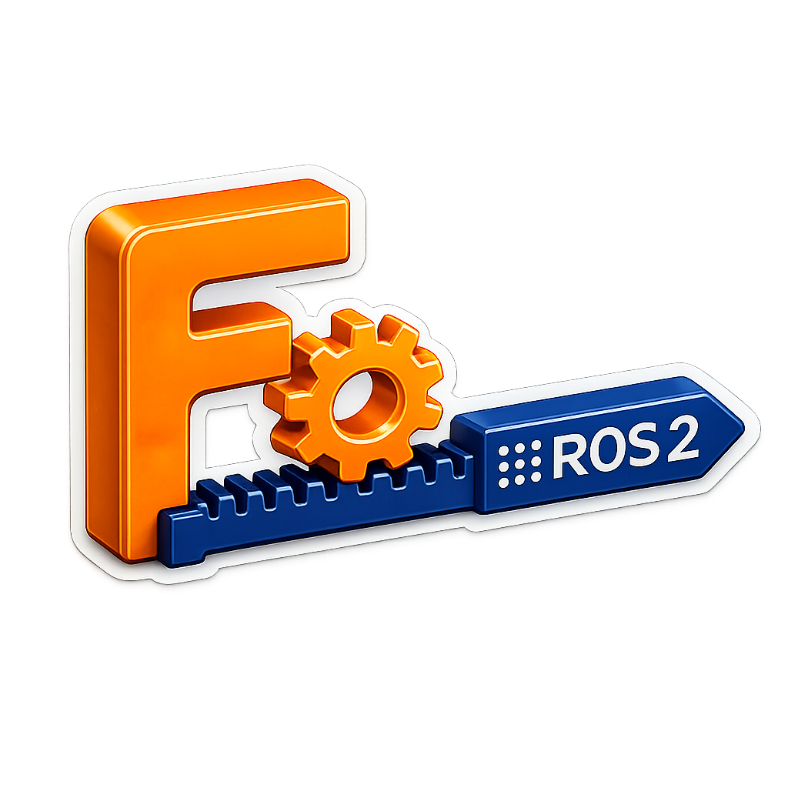

  
# FusionToDescription

### Convert Autodesk Fusion 360 assemblies into ROS 2 robot descriptions.

---

## 🚀 How to Use

1. Open your robot assembly in **Fusion 360**.
2. Launch **FusionToDescription** from **Scripts and Add-ins**.
3. Enter the **Robot Name**.
4. Select the **Download Location**.
5. Choose the **Collision Type**:
   - 🟦 Mesh Collision
   - 🟨 Primitive Collision
6. (Optional) Edit the **Mass** of each component.
7. Select the **Sensors** to include.
8. Enable **ROS 2 Control** if required.
9. Click **Export**.

> **Note:** The exporter automatically calculates the inertia tensor from the specified mass values.

---

## 📋 Assembly Guidelines

- ✅ The root component must be named **`base_link`**.
- ✅ Each component should contain **only bodies**.
- ❌ Do not nest components inside other components.
- ✅ Connect every component using **Joints**.
- ✅ Every body must belong to a single component.
- ✅ Fully constrain the assembly before exporting.

---

## 📦 Export Generates

- 📦 Robot component hierarchy
- ⚖️ User-defined mass values
- 🧮 Automatically calculated inertia
- 🛡️ Mesh or Primitive collision geometry
- 🔌 Gazebo sensor plugins
- 📡 `ros_gz_bridge` configuration for selected sensors
- 🤖 ROS 2 Control plugins *(optional)*
- 📄 Robot **Xacro** description ready for ROS 2 simulation

---

⭐ If you find this project useful, consider giving it a star!

